# Introduction 
## Dataset
The dataset I am using is the dataset [GSE155257](https://www.ncbi.nlm.nih.gov/geo/query/acc.cgi?acc=GSE155257). This dataset is from the paper MicroRNA analysis of human stroke brain tissue resected during decompressive craniectomy/stroke-ectomy surgery [@carlson2021microrna]. The experiment in the paper investigates the signalling pathways microRNAs mediate in stroke progression and recovery [@carlson2021microrna]. Carlson et al. collected human stroke brain tissue from 5 patients with malignant hemispehric stroke (test condition) and normal brain tissue from 3 patients who do not have a stroke (control condition). The data collected is RNA sequencing data.

## Previous work 
### Data processing 
Previously, I downloaded the the dataset [GSE155257](https://www.ncbi.nlm.nih.gov/geo/query/acc.cgi?acc=GSE155257). The dataset specifies genes using ensembl IDs. I cleaned the data by removing for low counts by the recommended edgeR protocol. Then, I normalized the data using TMM normalization [@edgeRCitation]. Afterwards, I mapped the data to HUGO symbols using the biomaRt R package [@BioMartCitation]. I removed any genes that cannot be mapped to HUGO symbols, and duplicate rows where ensembl IDs were mapped to multiple HGNC symbols. I then exported the data as a csv file.

The data processing steps can be viewed [here](https://github.com/bcb420-2023/Wing_Lam/blob/main/A1/A1.html)

### Different gene experssion analysis & thresholded over-representation analysis
Using the processed data saved in the csv file, I conducted differential gene expression analysis. I looked for significantly differentially expressed genes, then conducted multiple hypothesis testing to correct the p-values. I then visualized the top hits using a heatmap. Then, I saved 2 sets of genes: downregulated genes after correction and upregulated genes after correction.

I then be conducted thresholded over-representation analysis on the upregulated and downregulated set of genes. Threshold analysis was done using the Gprofiler tool. The genesets that were obtained supported the conclusions and mechanisms discussed in the original paper. There were multiple terms that relate to synaptic plasticity and inflammatory response, which is something [@carlson2021microrna] mentioned affect stroke progression and outcome. 

The steps for different gene expression analysis & thresholded over-representation analysis can be viewed [here](https://github.com/bcb420-2023/Wing_Lam/blob/main/A2_Wing_Lam.html)

## What I will be doing in this report
In this report, I will be conducting non-thresholded gene set enrichment analysis and visualizing the results in Cytoscape. 

# Non-thresholded Gene set Enrichment Analysis
Conduct non-thresholded gene set enrichment analysis on ranked set of genes from Assignment 2. 

In assignment 2, I did not create a rank file, therefore I had to do so before I begin my non-thresholded gene set enrichment analysis. The code used to create the rank file can be found in the accompanying [Assignment 3 journal entry](https://github.com/bcb420-2023/Wing_Lam/wiki/2.5-Assignment-3---Data-set-Pathway-and-Network-Analysis). This code has to be run after the [assignment 2 RMarkdown code](https://github.com/bcb420-2023/Wing_Lam/blob/main/A2/Assignment2.Rmd) is run and produces the file ranked_genelist.rnk

## What method did you use? What genesets did you use? Make sure to specify versions and cite your methods.
I am conducting non-thresholded gene set enrichment analysis using GSEA v4.3.2 [@gseaCite1] [@gseaCite2]. The GSEA application is downloaded from [here](http://www.gsea-msigdb.org/gsea/downloads.jsp). I used the GSEAPreranked method for my analysis. 

### Parameters:

Gene sets database: The gene sets database I used is from the [bader lab human EM geneset version March 02 2023](http://download.baderlab.org/EM_Genesets/March_02_2023/Human/symbol/Human_GOBP_AllPathways_no_GO_iea_March_02_2023_symbol.gmt ). I used the geneset file with hgnc symbols containing GO biological processes, not inferred from electronic annotations. 

Number of permutations: 1000 (default)

Ranked list: ranked_genelist.rnk  

Collapse/Remap to gene symbols: No_Collapse

Enrichment statistic: weighted (default)

Max size: exclude larger sets: 200 (as per suggestion in GSEA journal assignment)

Max size: exclude smaller sets: 15 (as per suggestion in GSEA journal assignment)

Collapsing mode for probe sets => 1 gene: Abs_max_of_probes (default)

Normalization mode: meandiv (default)

## Enrichment results.
Enrichment results are outputted as an html file after running the analysis. Here are screenshots of important results. 

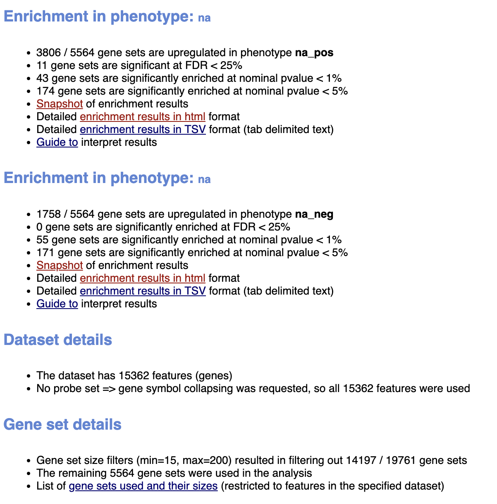 

**Figure 1. Summary results on non-thresholded enrichment analysis by GSEA**

### Stroke
#### Top 10 genesets
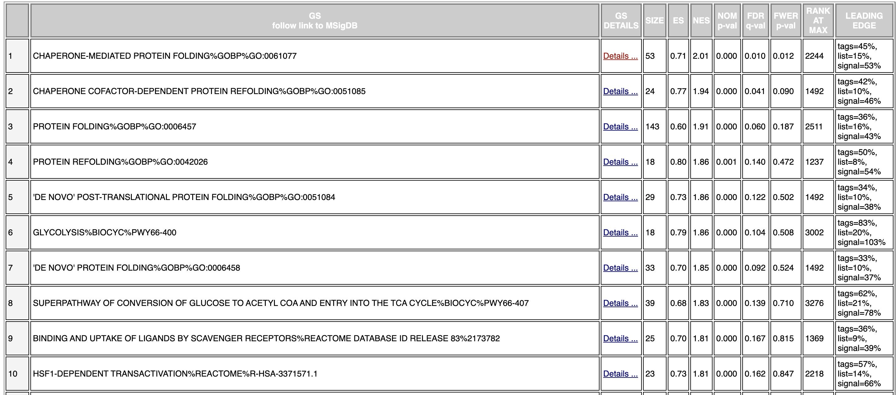 

**Figure 2. Top 10 genesets of stroke phenotype on non-thresholded enrichment analysis by GSEA**

#### Top geneset

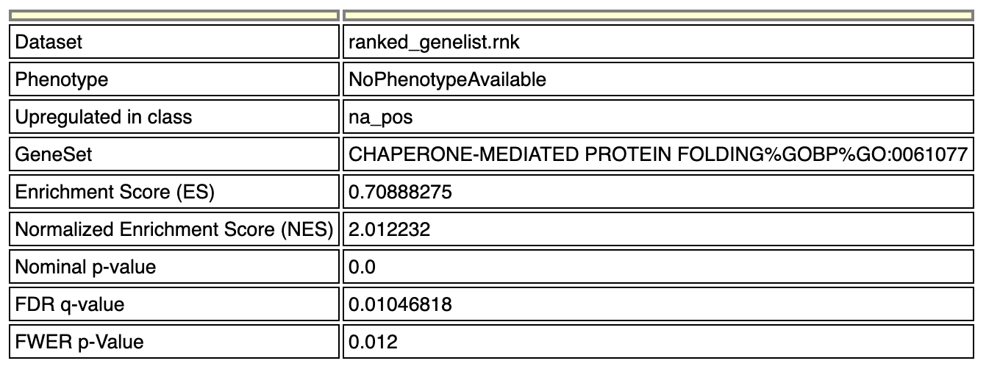 

**Figure 3. Details of top geneset of stroke phenotype on non-thresholded enrichment analysis by GSEA**

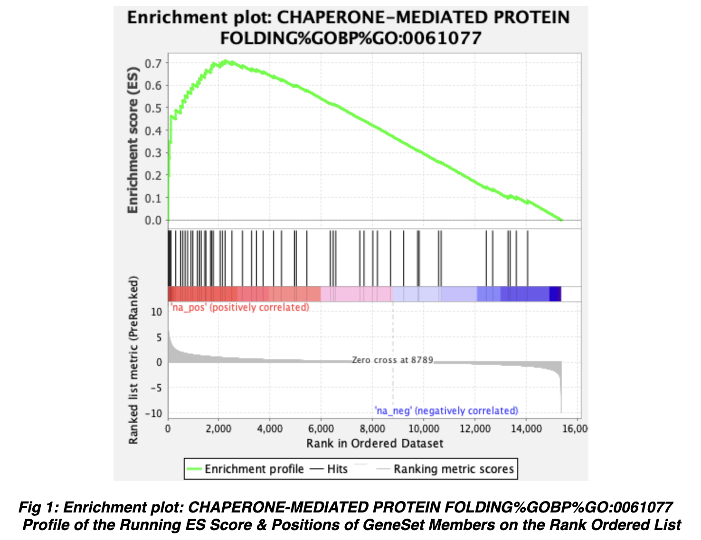 

**Figure 4. Enrichment plot of top geneset of stroke phenotype on non-thresholded enrichment analysis by GSEA**

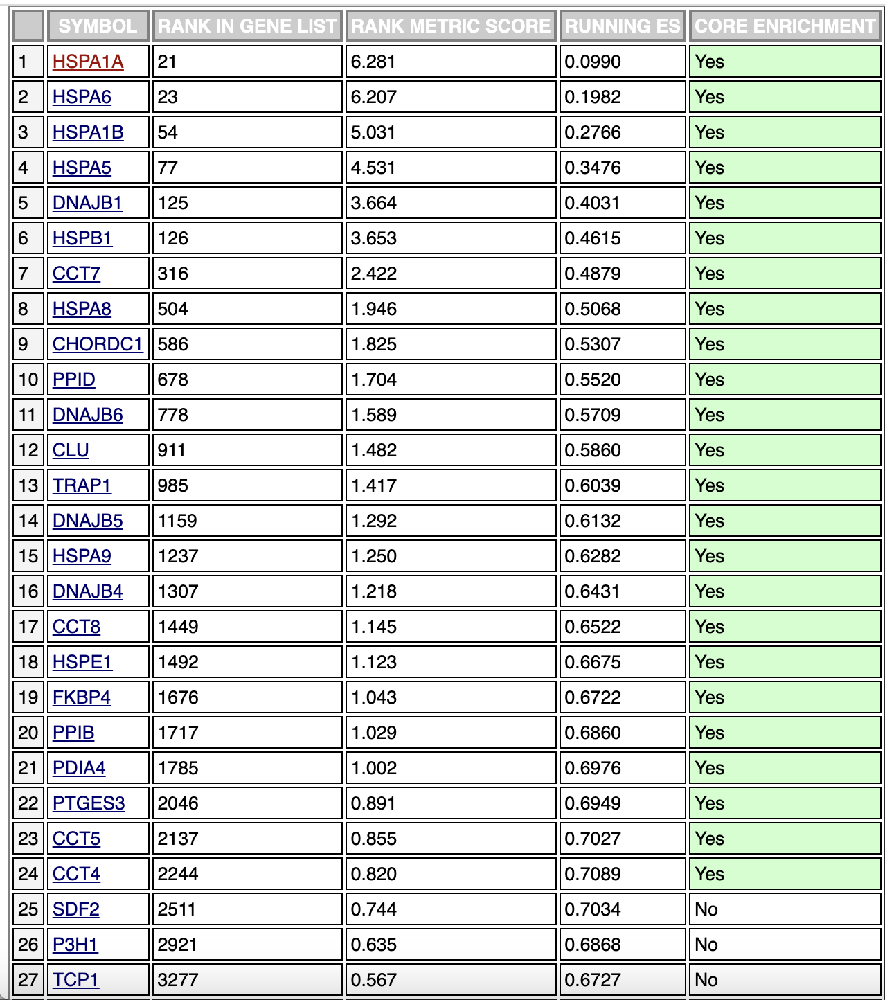 

**Figure 5. Enrichment plot of top genes of top gene set of stroke phenotype on non-thresholded enrichment analysis by GSEA**

### Control
#### Top 10 genesets

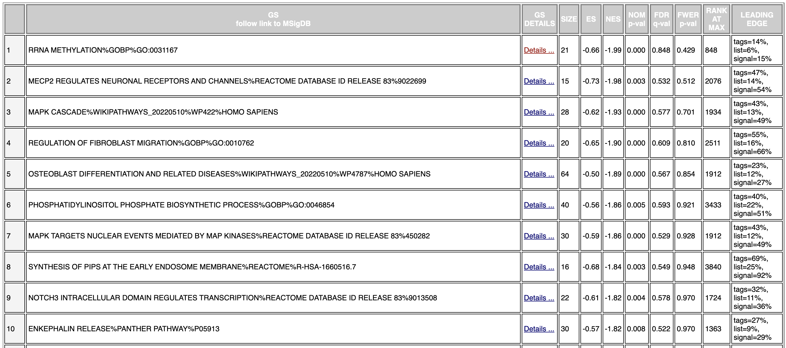 

**Figure 6. Top 10 genesets of control phenotype on non-thresholded enrichment analysis by GSEA**

#### Top geneset
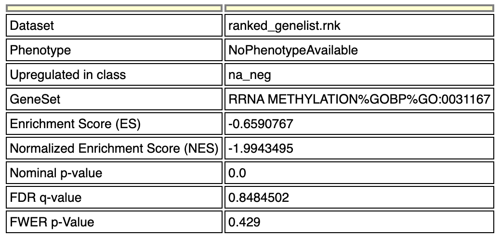 

**Figure 7. Details of top geneset of control phenotype on non-thresholded enrichment analysis by GSEA**

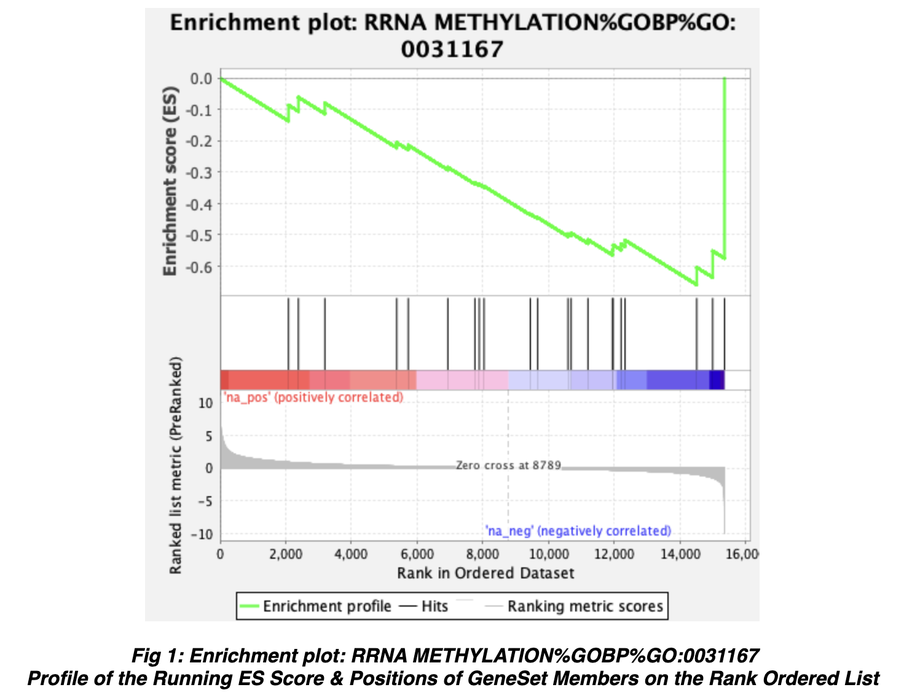 

**Figure 8. Enrichment plot of top geneset of control phenotype on non-thresholded enrichment analysis by GSEA**

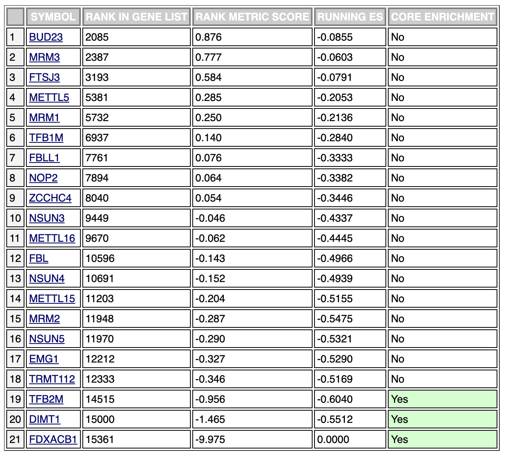 

**Figure 9. Top genes of top gene set of control phenotype on non-thresholded enrichment analysis by GSEA**

### Comments
While the top 10 gene sets for the stroke pheonotype all have FDR q-values of below 0.25 (which is the default cutoff GSEA uses), the control phenotype does not have a single geneset in its top 10 that has FDR q-values of below 0.25. 

In the stroke phenotype, the top gene set is chaperone-mediated protein folding. The top gene in this geneset is HSPA1A, a gene that the authors of the paper of this dataset [@carlson2021microrna] mentioned to be targeted by a miRNA, hsa-miR-6500-3p, that is downregulated in the stroke condition. If the presence of hsa-miR-6500-3p decreases the expression of HSPA1A, it would make sense that the downregulation of hsa-miR-6500-3p would lead to an increased expression in HSPA1A. Unfortunately, I cannot find literature that mentions the biological role of hsa-miR-6500-3p in either decreasing or increasing the expression of HSPA1A.

## How do these results compare to the results from the thresholded analysis in Assignment #2. Compare qualitatively. Is this a straight forward comparison? Why or why not?
The results obtained in the GSEA non-thresholded analysis differs from the thresholded analysis from G:profiler in the following ways: 

1. A lot of the gene sets found in G:profiler thresholded analysis were directly related to brain function, such as on regulation of neuronal synaptic plasticity, regulation of synaptic plasticity, chemical synaptic transmission, dendrite morphogenesis etc., while there were not any gene sets identified with non-threstholded analysis with GSEA did not stand out as brain function related. 

2. Some gene sets found in G:profiler thresholded analysis relate to brain functions that the authors of the paper the dataset [@carlson2021microrna] also identified to be stimulated after stroke (such as synaptic plasticity, dendrite morphogenesis etc), while at first glance, we do not see any overlap between the gene sets identified in GSEA non-thresholded analysis that directly correspond to the brain functions [@carlson2021microrna] identified to be stimulated after stroke. 

# Visualize your Gene set Enrichment Analysis in Cytoscape

## FDR q-value cutoff 0.1
Using the default FDR q-value cutoff 0.1, p-value 1.0, and a jaccard overlap combined of 0.375 (test used: Jaccard Overlap Index k constant = 0.5) in Cytoscape to create an enrichment map with the non-thresholded gene set enrichment analysis results, I get the following map:
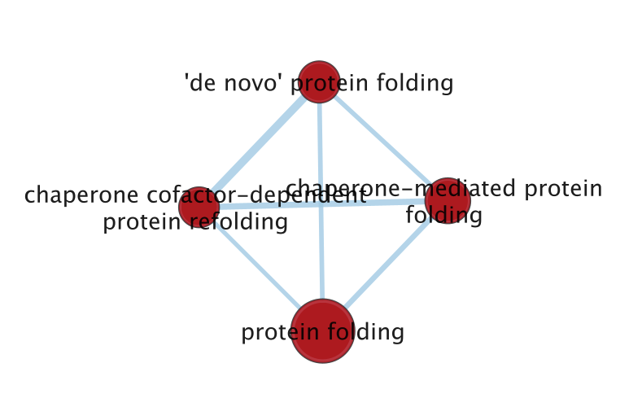  

**Figure 10. Visualization of top gene sets from GSEA enrichment Analysis in Cytoscape with FDR q-value cutoff 0.1**

The map has 4 nodes and 6 edges. 

I annotated the map using the AutoAnnotate app in Cytoscape. Annotation is done with following parameters (all parameters are default parameters): 
* Cluster Options
    * Use clusterMaker App: true
    * Cluser algorithm: MCL Cluster
    * Edge weight columnL None
    * Use-defined clusters: false
    * Create singleton clusters: false
    * Layout network to prevent cluster overlap: false
* Label Options
    * Label column: GS_DESCR 
    * Label Algorithm: WordCloud: Adjacent Words (default)
    * Max words per label: 3
    * Minimum word occurence: 1
    * Adjacent word bonus: 8 

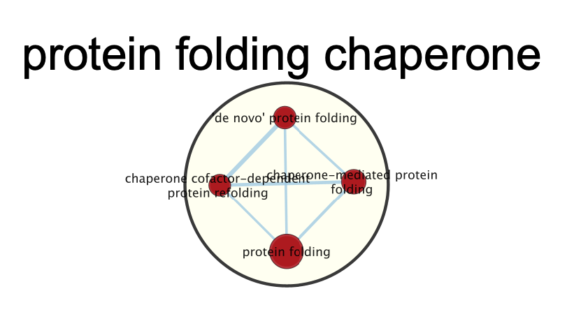  

**Figure 11. Annotated grouped visualization of top gene sets from GSEA enrichment Analysis in Cytoscape with FDR q-value cutoff 0.1**

We see that all gene sets are related to protein folding chaperones. 

## FDR q-value cutoff 0.25
I decided to increase the FDR q-value cutoff to 0.25, which is the default cutoff GSEA uses while leaving all other parameters constant. I get the following map:
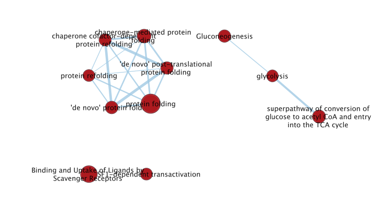  

**Figure 12. Visualization of top gene sets from GSEA enrichment Analysis in Cytoscape with FDR q-value cutoff 0.25**

After annotating the map using the AutoAnnotate app in Cytoscape (using the same parameters as above), we get this map:
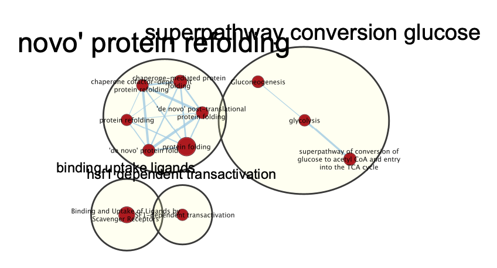  
**Figure 13. Annotated grouped visualization of top gene sets from GSEA enrichment Analysis in Cytoscape with FDR q-value cutoff 0.25**

This map has 11 nodes and 17 edges.

Here is a publication ready figure of the theme network with FDR q-value 0.25:
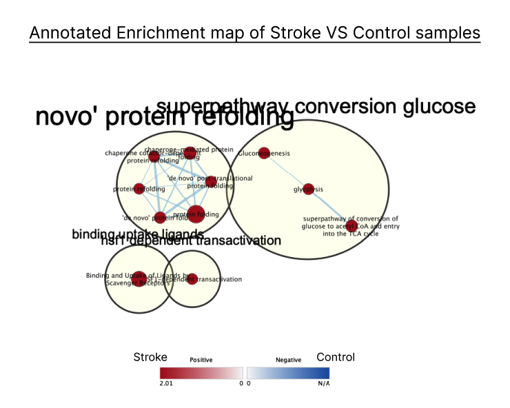  
**Figure 12. Publication ready figure of annotated grouped visualization of top gene sets from GSEA enrichment Analysis in Cytoscape with FDR q-value cutoff 0.25**

The major themes of the network is novo' protein refolding, superpathway conversion glucose, binding uptake ligands and hsf dependent transactivation. 

# Interpretation and detailed view of results
Unlike the G:Profiler thresholed enrichment analysis results, the GSEA non-thresholded analysis results do not seem to have overlap with the conclusions or mechanisms discussed in the original paper. However, we can find evidence from other publications to support some the results we see. 

When we look for publications on protein refolding after stroke, we can see that heat shock proteins are involved in protein refolding after stroke, and some heat shock proteins, such as hsp70, are investigated for their role in stroke recory as a potential theurapeutic target [@hpsStroke1] [@hpsStroke2]. When we look at the genes involved in the GSEA gene sets that involve protein refolding, we do see multiple heat shock protein genes that are considered core enrichment genes. 

When we look for publications on glucose conversion after stroke, we can see that during stroke, the brain does activate regulatory processes to meet the energy demands of the brain [@glucose]. Altered pathways involved in glucose intake, such as gluconogenesis and glycolysis, which is shown in my annotated enrichment map, is studied for their effects during and after stroke and ischemia in the papers such as [@glucose] [@glucose2]. 

# Choose a specific pathway or theme to investigate in more detail
I chose the chaperone-mediated protein folding gene set as the theme to investigate in more detail as it is the top gene set returned in non-thresholded gene set enrichment analysis by GSEA. 

As the chaperone-mediated protein folding is a GO pathway, I used GeneMANIA [@genemania] to build the interaction network. 

I annotated the network with the original log fold expression and p-values. 

## Annotated with original log fold expression
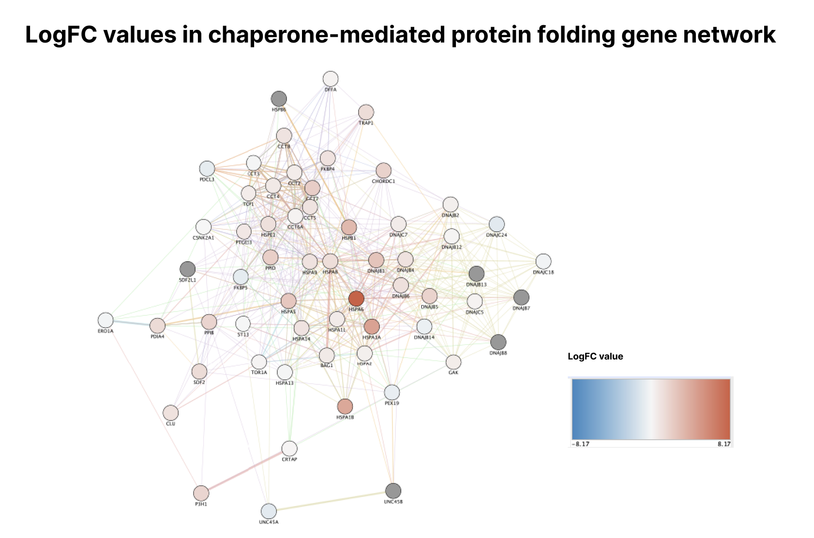  

**Figure 13. Chaperone-mediated protein folding gene set interaction network annotated with original log fold expression**

## Annotated with original p-values

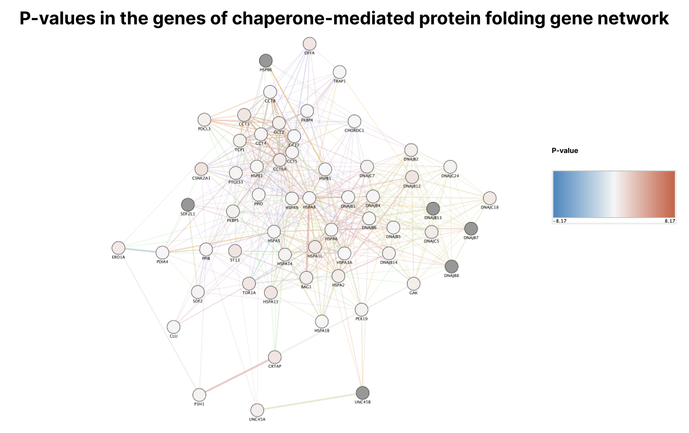  

**Figure 14. Chaperone-mediated protein folding gene set interaction network annotated with original p-values**

# References
